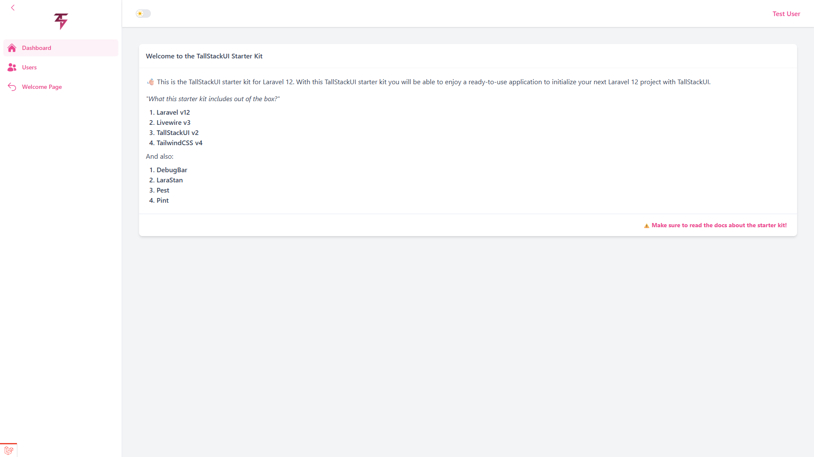
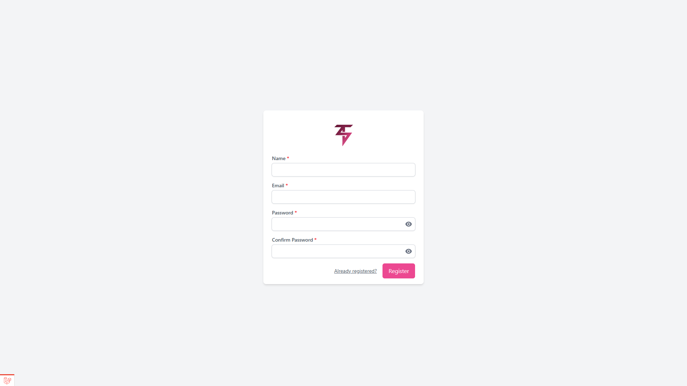
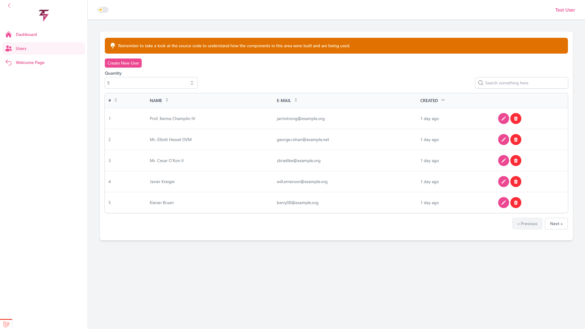
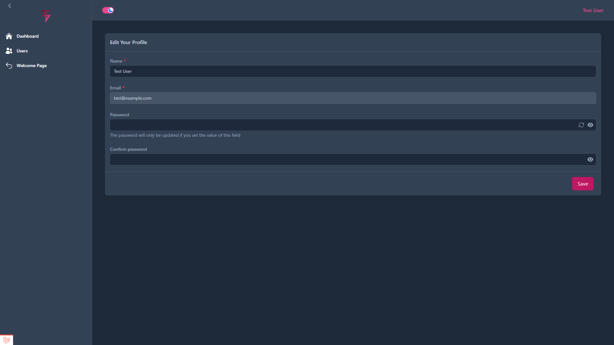
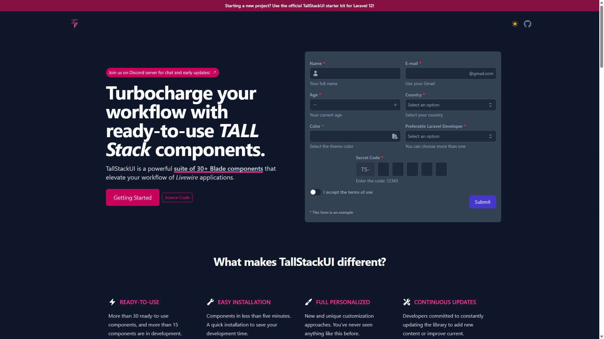
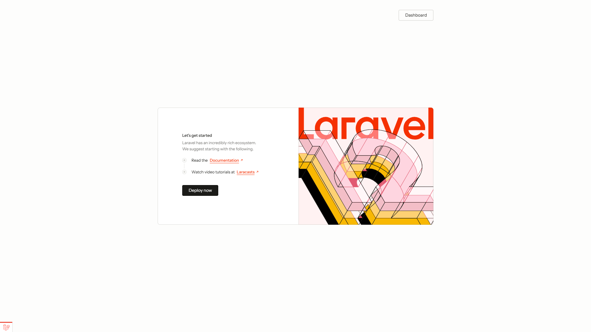
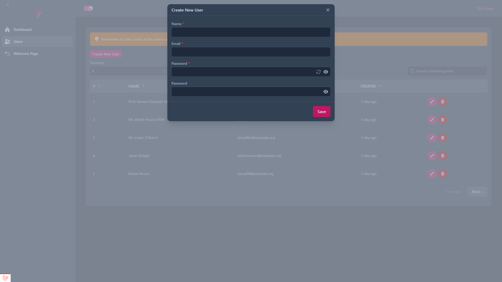
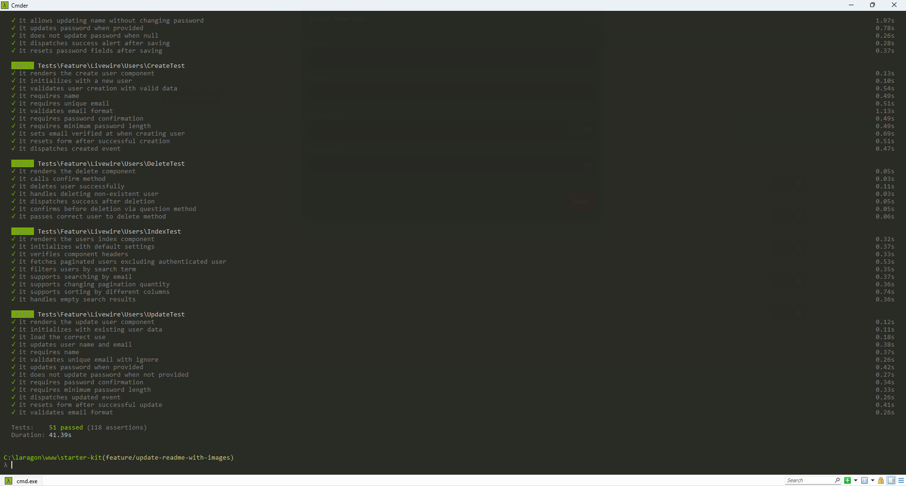

# TallStackUI Starter Kit


The **TallStackUI Starter Kit** is an official starter kit for Laravel 12 that provides a solid foundation ready for real-world use, saving time on basic setup of new Laravel projects.

## 🚀 Key Features

### Technology Stack
- **Laravel 12** - Modern PHP framework
- **Livewire 3** - Full-stack dynamic components
- **TallStackUI 2** - UI component library
- **TailwindCSS v4** - Utility-first CSS framework

### Included Features

#### 📱 Responsive and Modern Interface


#### 🔐 Complete Authentication System


- Login and registration system
- Profile update page
- Authentication based on Laravel Breeze

#### 👥 Users CRUD


Complete CRUD example including:
- User listing
- Creating new users
- Data updates
- Record deletion

#### 🌙 Dark Theme Support


Integrated theme switcher for better user experience.

#### 📊 TallStackUI Components


Over 30 ready-to-use components:
- Forms
- UI elements
- Interactions
- Error handling
- And much more

## 🛠️ Installation

### Prerequisites
- Laravel Installer installed
- PHP 8.2+
- Composer

### Using Laravel Installer (Recommended)
```bash
laravel new project --using=tallstackui/starter-kit
```

### Manual Installation
```bash
git clone https://github.com/tallstackui/starter-kit.git project
cd project
rm -rf .git
composer install
npm install
cp .env.example .env
php artisan key:generate
php artisan migrate
```

## 🎯 Getting Started

### Initial Access


After installation, access your project. The home page will be the default Laravel page with login and registration buttons at the top.

### Default Credentials
- **Email:** `admin@tallstackui.com`
- **Password:** `password`

### Exploring the CRUD


Navigate to `/users` to see the complete CRUD example in action.

## 🏗️ Project Structure

### Livewire Components Organization
```
App\Livewire\Users\
├── Index.php      # Main listing
├── Create.php     # User creation
├── Update.php     # Data updates
└── Delete.php     # Record deletion
```

### Included Development Resources

#### 🧪 Automated Testing


```bash
composer test
```

#### 📊 Code Analysis
```bash
composer analyse  # PHPStan
composer format   # Pint
composer ci       # Complete pipeline
```

## 🎨 Customization

### Colors and Theme
![Color Customization]

The starter kit uses a primary color based on TallStackUI documentation color, easily customizable through the single configuration file.

### Simplified Configuration
- Single published configuration file
- All unnecessary comments removed
- Clean and organized structure

## 📈 Benefits

### ⚡ Accelerated Development
![Fast Development]

- Significant time savings on initial setup
- Pre-built and tested components
- Established development patterns

### 🔧 Production Ready
![Production Ready]

- SQLite database connection configured
- Comprehensive test coverage included
- Integrated code quality tools

## 📚 Documentation

For complete documentation, visit: [TallStackUI Documentation](https://tallstackui.com/docs/v2/starter-kit)

## 🤝 Contributing

Want to improve the starter kit? [Send us a pull request!](https://github.com/tallstackui/starter-kit)

## 📄 License

This project is licensed under the MIT License - see the LICENSE file for details.